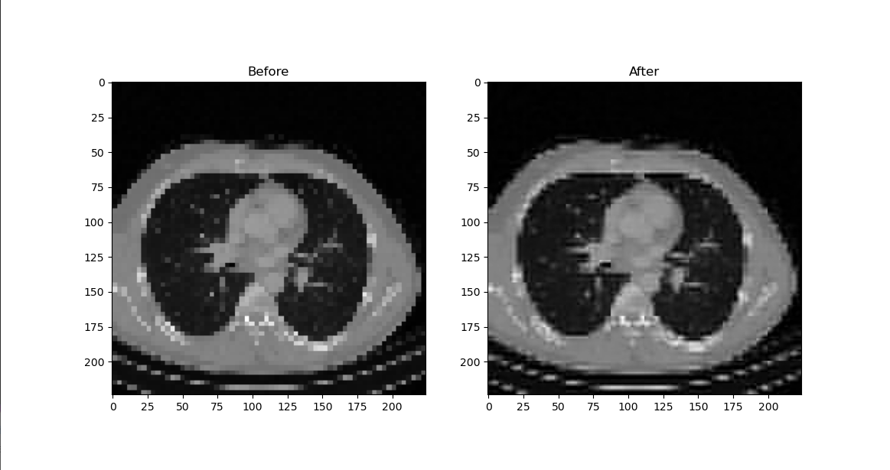
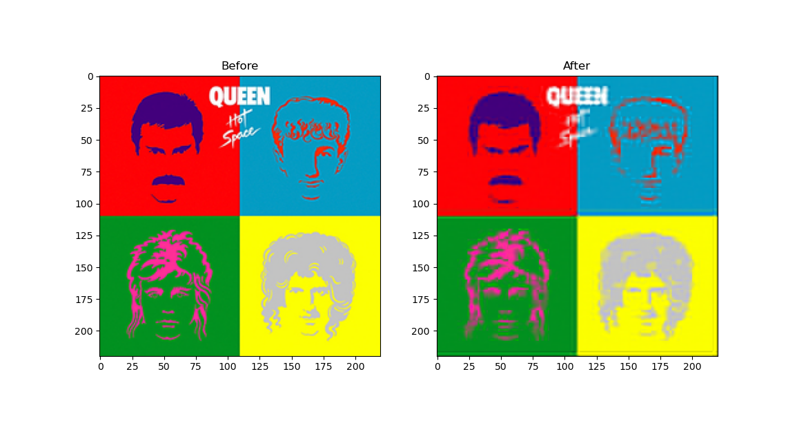
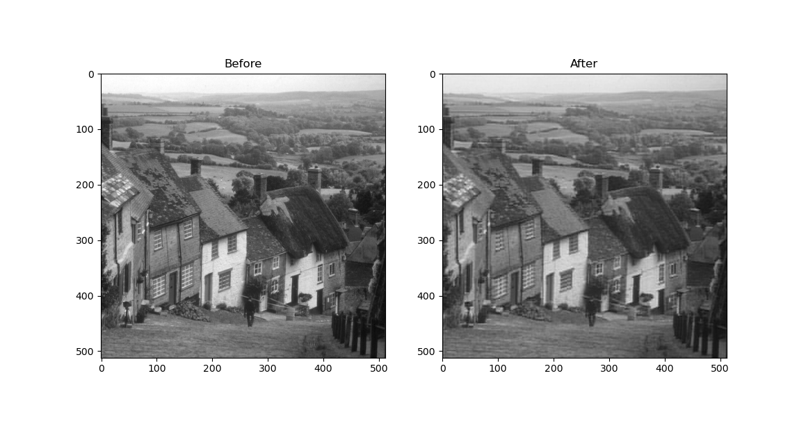

This project is an implementation of the original JPEG file format (not JPEG2000) in Python, using the discrete cosine transform and inverse discrete cosine transform. It chooses not to output the compressed data to the disk, although it is entirely possible to do so. The output shows two images, the one on the left being the original copy of the image, and the one on the right being the image after compression and decompression. 
This implementation uses two variables, a block size, and a mask width. The mask used is a right triangle in the upper left corner with its opposite and adjacent edges set to the length of the mask width. This implementation uses this known information to apply optimizations in order to improve processing times. These two variables can be used to adjust image quality.  
Below are images of the output using the included example images. The variables are set to be fairly lossy, only using roughly 15.625% of the original data, in order to show how much is reconstructed from such a small amount of information.  
 
 

